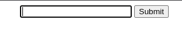
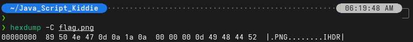

# Java Script Kiddie
**Author:** John Johnson

# 1. Description
The challenge provides a web page where an image appears to be broken. Our goal is to reconstruct the image by finding the correct 16-digit key.


# 2. Analysis
Source Code Review
Looking at the index.html source, we find a JavaScript function assemble_png(u_in) that processes a local file named bytes.


The core logic of the shuffling algorithm is as follows:
```
var bytes = [];
$.get("bytes", function(resp) {
  bytes = Array.from(resp.split(" "), x => Number(x));
});

function assemble_png(u_in){
  var LEN = 16;
  var key = "0000000000000000";
  var shifter;
  if(u_in.length == LEN){
    key = u_in;
  }
  var result = [];
  for(var i = 0; i < LEN; i++){
    shifter = key.charCodeAt(i) - 48;
    for(var j = 0; j < (bytes.length / LEN); j ++){
      result[(j * LEN) + i] = bytes[(((j + shifter) * LEN) % bytes.length) + i]
    }
  }
  while(result[result.length-1] == 0){
    result = result.slice(0,result.length-1);
  }
  document.getElementById("Area").src = "data:image/png;base64," + btoa(String.fromCharCode.apply(null,newUint8Array(result)));
  return false;
}
```

**Key Takeaways:**

1. Key Format: The key is exactly 16 characters long (LEN = 16), consisting only of digits (0-9).
2. Data Structure: The bytes file contains 704 integers. With a LEN of 16, the data can be viewed as a grid of 44 rows ($704 / 16 = 44$).
3. Shifting Mechanism: Each digit in the key acts as a shifter for its corresponding column. It determines which row in the original bytes array will become the first row ($j=0$) in the resulting PNG.3.
# 3. Exploitation Strategy: Known Plaintext Attack
Every PNG file must start with a standard 16-byte header to be valid:
 - 8-byte Signature: 89 50 4E 47 0D 0A 1A 0A
 - IHDR Chunk (Length & Type): 00 00 00 0D 49 48 44 52


Since the shifter for each column is independent, we can perform a Known Plaintext Attack by brute-forcing each of the 16 positions individually. We only need to check which shifter (0-9) places the correct expected PNG header byte at the first row _(j = 0)_.

**Scripting the Solution**
We can simplify the index formula for the first row _(j = 0)_:

`_bytes_index = shifter * 16) (mod 704)) + key_position_`

Here is the Python script to find the key:
```
bytes_data = [69, 36, 1, 151, 249, 58, 81, 34, 0, 191, 105, 66, 249, 247, 
		    243, 198, 137, 156, 68, 233, 167, 190, 130, 0, 1, 243, 0, 219, 61, 242, 0, 
		    228, 0, 221, 78, 230, 88, 16, 26, 10, 84, 82, 0, 63, 249, 172, 0, 135, 164, 
		    27, 1, 110, 191, 222, 1, 114, 200, 0, 0, 59, 76, 188, 68, 73, 64, 127, 0, 
		    174, 24, 61, 68, 65, 24, 0, 156, 0, 9, 0, 95, 0, 33, 78, 69, 71, 205, 255, 
		    44, 109, 6, 0, 114, 0, 231, 0, 106, 82, 229, 80, 154, 114, 50, 203, 50, 7, 
		    199, 120, 47, 13, 239, 72, 114, 108, 72, 0, 59, 2, 66, 96, 199, 211, 139, 
		    1, 209, 0, 0, 192, 22, 228, 119, 0, 169, 159, 13, 10, 99, 241, 204, 40, 112, 
		    237, 0, 65, 241, 164, 48, 12, 121, 27, 0, 0, 173, 88, 201, 105, 191, 148, 
		    73, 13, 231, 85, 30, 71, 179, 100, 126, 73, 206, 239, 221, 167, 73, 3, 0, 
		    127, 192, 65, 18, 184, 186, 212, 198, 134, 146, 116, 178, 89, 183, 216, 155, 
		    111, 2, 157, 156, 45, 122, 231, 184, 142, 55, 3, 7, 7, 1, 112, 242, 121, 
		    230, 98, 227, 222, 30, 225, 146, 16, 197, 52, 9, 127, 209, 24, 54, 45, 209, 
		    179, 143, 213, 215, 19, 38, 62, 93, 177, 127, 179, 90, 82, 93, 66, 127, 167, 
		    159, 96, 251, 178, 223, 226, 157, 128, 68, 24, 102, 30, 222, 119, 59, 122, 
		    33, 161, 71, 222, 64, 61, 223, 249, 155, 66, 241, 96, 76, 237, 128, 214, 17, 
		    255, 215, 248, 208, 72, 178, 92, 102, 128, 167, 238, 2, 195, 218, 92, 17, 
		    252, 251, 242, 59, 65, 62, 60, 5, 91, 163, 176, 231, 122, 249, 57, 222, 243, 
		    134, 32, 126, 166, 102, 146, 211, 31, 119, 38, 102, 141, 59, 96, 20, 110, 
		    158, 143, 246, 234, 59, 129, 148, 46, 173, 111, 100, 145, 216, 87, 160, 221, 
		    165, 38, 213, 191, 176, 91, 177, 202, 252, 199, 144, 125, 115, 255, 211, 26, 
		    128, 201, 183, 166, 35, 130, 71, 45, 97, 247, 14, 244, 23, 47, 249, 222, 
		    252, 147, 95, 247, 83, 33, 124, 239, 98, 249, 204, 133, 185, 127, 49, 255, 
		    114, 28, 63, 40, 223, 244, 211, 59, 212, 133, 249, 105, 65, 35, 115, 198, 
		    159, 78, 140, 104, 69, 139, 232, 25, 250, 59, 246, 167, 209, 91, 105, 17, 
		    173, 59, 175, 241, 55, 13, 223, 198, 201, 141, 160, 92, 95, 51, 60, 239, 
		    203, 255, 108, 202, 236, 36, 239, 107, 206, 105, 113, 17, 206, 253, 44, 85, 
		    159, 100, 146, 82, 85, 142, 45, 58, 8, 3, 150, 179, 47, 83, 61, 98, 246, 
		    106, 150, 135, 91, 213, 84, 74, 71, 157, 221, 8, 145, 191, 165, 41, 77, 3, 
		    158, 148, 68, 79, 94, 197, 28, 186, 164, 253, 228, 30, 159, 219, 206, 150, 
		    116, 243, 86, 176, 230, 252, 181, 214, 52, 83, 175, 13, 239, 63, 175, 80, 
		    16, 175, 90, 149, 151, 54, 173, 105, 255, 160, 60, 98, 242, 102, 249, 137, 
		    26, 105, 86, 175, 13, 205, 180, 248, 77, 187, 35, 243, 132, 245, 110, 63, 
		    47, 245, 90, 68, 82, 55, 10, 174, 72, 249, 223, 63, 223, 46, 54, 253, 74, 
		    176, 178, 94, 54, 215, 221, 63, 49, 214, 251, 247, 115, 140, 122, 87, 233, 
		    92, 164, 117, 104, 130, 254, 142, 240, 91, 175, 19, 127, 25, 180, 81, 184, 
		    249, 102, 90, 237, 41, 169, 22, 199, 238, 142, 247, 111, 117, 55, 249, 81, 
		    157, 184, 133, 155, 233, 233, 40, 210, 180, 249, 251, 254, 252, 212, 85, 
		    241, 27, 4, 108, 124, 28, 124, 191, 95, 229, 127, 158, 122, 186, 241, 142, 
		    125, 201, 192, 212, 203, 245, 99, 61, 89, 191, 252, 117, 12, 147, 223, 73, 
		    190, 76, 159, 84, 188, 158, 175, 199, 229, 157, 243, 15, 251, 50, 179, 162, 
		    227, 55, 206, 239, 19, 226, 93, 88, 39, 206, 234, 245, 243, 195, 103, 65, 
		    163, 95, 223, 237, 0, 36, 206, 255, 47, 164, 28, 65]

HEADER_PNG = [137, 80, 78, 71, 13, 10, 26, 10, 0, 0, 0, 13, 73, 72, 68, 82]  

LENGTH = 16

def all_keys (* candidates):
    pools = [tuple(pool) for pool in candidates]
    
    result = [[]]
    for pool in pools:
        result = [x+[y] for x in result for y in pool]

    for prod in result:
        yield tuple(prod)
        
    return result

def solve():
    candidates = []
    
    for i in range (16):
        possible_shifters = []
        target = HEADER_PNG[i]
        
        for shifter in range (10):
            bytes_index = (shifter * LENGTH) + i
            
            if (bytes_data[bytes_index] == target):
                possible_shifters.append(shifter)
        
        candidates.append(possible_shifters)
        
    All_Keys = list(all_keys(*candidates))
    
    for key in All_Keys:
        key_str = "".join(map(str, key))
        print(key_str)
        
solve()        
```

# 4. Conclusion
After running the script, we obtained the 16-digit key. Entering this key into the input field on the website reconstructed the PNG file, which was a QR code. Scanning the QR code revealed the flag.

